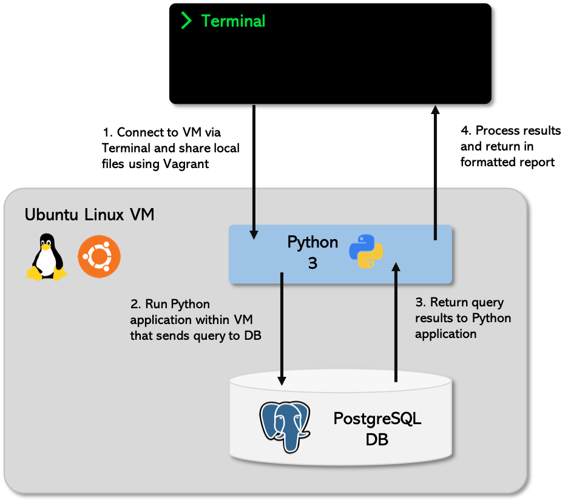

# 1. Logs Analysis

This logs analysis project is a simple application that generates a report based on a `news` database, answering the following three questions:
1. What are the most popular three articles of all time?
2. Who are the most popular article authors of all time?
3. On which days did more than 1% of requests lead to errors?

***

## Code Design
- The architecture for this application consists of a PostgreSQL database deployed on a Linux Virtual Machine (VM), along with a Python application that manages the queries and creation of the report. See the below architecture diagram for a detailed overview.

 

    

 

- I used three tables and four views (described below) for the analysis with a focus on returning a concise result set to the Python application.
- The code itself consists of two Python files:
    - **logs_analysis.py**: this module runs the Python application and returns a formatted report.
    - **logs_analysisdb.py**: this file consists of three functions that manage the SQL queries and collects the result sets to be used by the application.
- I decided to create two code files to keep the SQL processing and formatting separate from each other, I found this made it simpler when thinking about how the database and application will communicate.

***

## Installation

### Installing the VM software
For this application to run, we need to install and configure a Linux VM on top of your operating system. For this, you will need to install 2 pieces of software:
- **VirtualBox**: https://www.virtualbox.org/wiki/Downloads
    - This is the software that actually runs the VM. Install the *platform package* for your operating system, you do not need the extension pack or the SDK. You do not need to launch VirtualBox after installing it, we can do this via Vagrant. 
- **Vagrant**: https://www.vagrantup.com/downloads.html
    - Vagrant is the software that configures the VM and lets you share files between your host computer and the VM's filesystem.

You will also need a Unix-style terminal program. On Mac or Linux systems you can use the built-in Terminal. On Windows, Git Bash is recommended. 

### Starting the VM Image
Once you have VirtualBox and Vagrant installed, open a terminal and run the following commands:

    $ mkdir logs_analysis
    $ cd logs_analysis

This will create a new directory for this project. Then, download this ZIP file:
- https://s3.amazonaws.com/video.udacity-data.com/topher/2018/April/5acfbfa3_fsnd-virtual-machine/fsnd-virtual-machine.zip

This will download the Linux image `FSND-Virtual-Machine` into your downloads folder. Once it's finished downloading, open the folder `FSND-Virtual-Machine` and move everything within it into your `logs_analysis` folder. The Linux instance is now within the `logs_analysis` directory. Now we want to start the image. Navigate to your `logs_analysis` folder and issue the following commands:

    $ cd vagrant
    $ vagrant up

Next, to log into the Linux instance, run:

    $ vagrant ssh

Congratulations! You've now installed the Linux image, started the VM and are logged into the VM via ssh. If you log out of the Linux instance or close the terminal, the next time you want to use it you only need to run `cd logs_analysis` and `vagrant ssh`.

### Configuring Python and Psycopg2
To install the correct version of Python and Psycopg2, make sure you're still working within the installed VM. If not, `cd logs_analysis` and run `vagrant ssh`.
#### Python
For this project, we will be using Python 3. Check the version of Python installed within the VM by running:

    $ python --version

If the VM is using Python 2 (returning something that looks like this: "Python 2.x.x"), then you must upgrade this to Python 3 ("Python 3.x.x"). If you already have Python 3 installed, then skip to the next part on installing Psycopg2. To upgrade Python 2 to Python 3, use the following commands:

Download the package lists from the repositories and update them.

    $ sudo apt-get update

Install Python 3

    $ sudo apt-get install python3

Change the default Python version

    $ sudo rm /usr/bin/python
    $ sudo ln -s /usr/bin/python3 /usr/bin/python

Check that Python 3 is installed and active. The output of this command should be something like "Python 3.5.2".

    $ python --version

#### Psycopg2
Psycopg2 is the most popular PostgreSQL adapter for the Python programming language. See the documentation for more details: http://initd.org/psycopg/. To install this package, use the following commands:

    $ sudo apt-get install libpq-dev python-dev
    $ sudo pip install pyscopg2-binary

Now you will have both Python 3 and Psycopg2 installed, you're ready to set up the database tables and views.

### Set up Database
Download the data for this project here: https://d17h27t6h515a5.cloudfront.net/topher/2016/August/57b5f748_newsdata/newsdata.zip. You will need to unzip this file after downloading it. The file inside is called `newsdata.sql`. Put this file into the `logs_analysis/vagrant` directory. This folder is shared with your VM, so anything that locally appears in this file, will also be available within the VM.

Now we need to load the data into a database. Make sure you're still logged into the VM via ssh then run the following commands to access the shared folder and create the database:

    $ cd /vagrant
    $ psql -d news -f newsdata.sql

- `psql` - is the PostgreSQL command line program
- `-d news` - connect to the database named news which has been set up
- `-f newsdata.sql` - run the SQL statements in the file newsdata.sql

Running these commands will connect to your installed database server and execute the SQL commands in the downloaded file, creating tables and populating them with data. 

The database includes 3 tables giving information about news articles on a website:
- **authors** - includes information about the authors of the articles
- **articles** - includes information about the articles posted on the website
- **log** - includes a transactional table for each time a user has accessed the website

The report generated by the Python application (which you'll be installing soon) will use the tables in this database to create the results. However, to minimise client side processing you must create the following views for the Python application to access. **Note**: without these views the Python application will not run, so make sure to create them first.

To check that you're working within the `news` database, your terminal should look like this:

    psql (9.5.14)
    Type "help" for help.
    
    news=>

If it does not, then run `psql news`. Then, run the following commands to create the views:

**log_slug**

    create view log_slug as select split_part(path, '/', 3) as slug, method, status from log;

**author_views**

    create view author_views as select name, num from authors join (select articles.author, count(log_slug.slug) as num from articles left join log_slug on articles.slug=log_slug.slug group by articles.author order by num desc) as a on authors.id=a.author;

**log_daily**

    create view log_daily as select date(time) as date, count(*) as requests from log group by date;

**log_daily_pct_error**

    create view log_daily_pct_error as select log_daily.date, requests, errors, (errors/requests::float)*100 as pct_error from log_daily join (select date(time) as date, count(*) as errors from log where status = '404 NOT FOUND' group by date) as a on log_daily.date=a.date;

Once you've issued these commands, run `\d` to check that they all exist within the database. Now you're ready to install and run the Python application. 

### Install Python application
The SQL query handling and report creation will be done through a Python application that you will run within the VM. To install this application, open up a fresh terminal window (outside of the VM) and issue the following commands:

    $ cd logs_analysis/vagrant 
    $ git clone https://github.com/agodwinp/1.-Logs-Analysis.git

Within the vagrant folder, you should now see a `1. Logs Analysis` folder containing the following files:
- **Architecture.png**
    - Not necessary for the Python application, but makes for nice looking documentation. 
- **README.md**
    - Readme file for the repository.
- **example_output.txt**
    - A text file containing an example output of what you should see in the terminal when you run the application. 
- **logs_analysis.py**
    - The Python application run as a module. 
- **logs_analysisdb.py**
    - A Python file that handles the database queries and result sets.

***

## Usage

Now you are ready to run the application! You must ssh into the VM, then access the shared files folder and finally run the application. To do this, run the following commands:

    $ cd logs_analysis/vagrant
    $ vagrant ssh
    $ cd /vagrant
    $ cd "1. Logs Analysis"
    $ python logs_analysis.py

When you run the final command, you should receive an output in your terminal like the one described in the txt file.

***

Well done! You ran a Python application connecting to a database server on a Linux VM! Let me know what you think

***

## Authors

- **Arun Godwin Patel** - Machine Learning Developer & Data Scientist